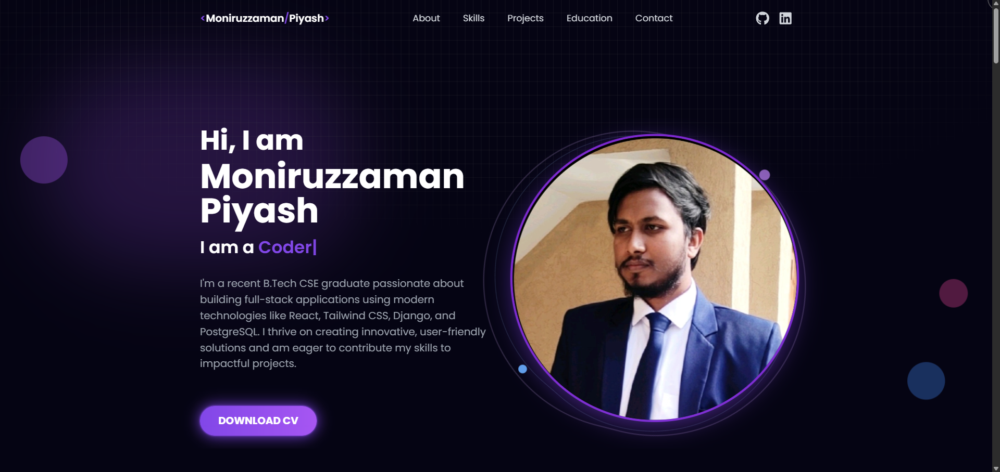
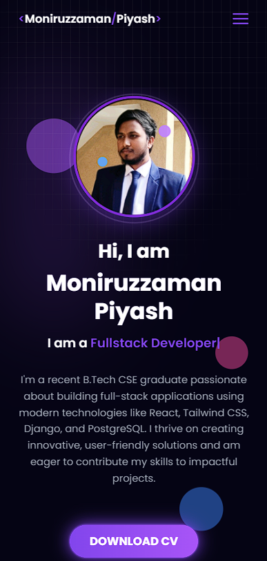

# 🚀 Moniruzzaman Piyash - Portfolio

<div align="center">
  
  
  
  
</div>

<div align="center">
  <h3>🌟 A Modern, Responsive Portfolio Website 🌟</h3>
  <p>Showcasing my skills, projects, and experience as a Full-Stack Developer</p>
</div>

---

## 🚀 Live Demo

**[View Live Portfolio](https://moniruzzamanpiyash.netlify.app/)**

## 📸 Screenshots

<div align="center">
  
  
</div>

## 📋 Table of Contents

- [✨ Features](#-features)
- [🛠️ Tech Stack](#️-tech-stack)
- [🚀 Getting Started](#-getting-started)
- [📱 Sections](#-sections)
- [🎨 Design](#-design)
- [📧 Contact Form](#-contact-form)
- [🌐 Deployment](#-deployment)
- [📸 Screenshots](#-screenshots)
- [🤝 Contributing](#-contributing)
- [📄 License](#-license)

## ✨ Features

- **🎯 Modern Design**: Clean, professional, and visually appealing interface
- **📱 Fully Responsive**: Optimized for all devices (Desktop, Tablet, Mobile)
- **⚡ Fast Performance**: Built with Vite for lightning-fast loading
- **🎨 Smooth Animations**: Framer Motion powered animations and transitions
- **🌙 Dark Theme**: Elegant dark theme with purple accent colors
- **📧 Contact Form**: Working contact form with EmailJS integration
- **🎭 Interactive Elements**: Hover effects, custom cursor, and micro-interactions
- **♿ Accessibility**: WCAG compliant with proper semantic HTML
- **🔍 SEO Optimized**: Meta tags and structured data for better search visibility

## 🛠️ Tech Stack

### Frontend
- **React 18.3.1** - Modern UI library
- **Vite 6.0.5** - Fast build tool and dev server
- **Tailwind CSS 3.4.17** - Utility-first CSS framework
- **Framer Motion 12.23.12** - Animation library
- **React Icons 5.4.0** - Icon library
- **React Typing Effect 2.0.5** - Typing animation
- **React Parallax Tilt 1.7.282** - 3D tilt effects

### Backend & Services
- **EmailJS 4.4.1** - Email service for contact form
- **React Toastify 11.0.3** - Toast notifications
- **GSAP 3.13.0** - Advanced animations

### Development Tools
- **ESLint** - Code linting
- **PostCSS** - CSS processing
- **Autoprefixer** - CSS vendor prefixing

## 🚀 Getting Started

### Prerequisites
- Node.js (v16 or higher)
- npm or yarn

### Installation

1. **Clone the repository**
   ```bash
   git clone https://github.com/yourusername/portfolio.git
   cd portfolio
   ```

2. **Install dependencies**
   ```bash
   npm install
   ```

3. **Start development server**
   ```bash
   npm run dev
   ```

4. **Open your browser**
   ```
   http://localhost:5173
   ```

### Available Scripts

```bash
npm run dev      # Start development server
npm run build    # Build for production
npm run preview  # Preview production build
npm run lint     # Run ESLint
```

## 📱 Sections

### 🏠 **About**
- Personal introduction with typing effect
- Professional profile image with 3D tilt
- Download CV button with animations
- Floating background elements

### 🛠️ **Skills**
- Categorized skill sets (Frontend, Backend, Languages, Tools)
- Interactive skill cards with hover effects
- Technology logos and names
- Responsive grid layout

### 💼 **Projects**
- Showcase of personal projects
- Project cards with images and descriptions
- Technology tags for each project
- Live demo and GitHub links
- Modal popup for detailed project view

### 🎓 **Education**
- Timeline of educational background
- Institution logos and details
- Academic achievements and grades
- Animated timeline with scroll effects

### 📧 **Contact**
- Working contact form with validation
- EmailJS integration for email sending
- Toast notifications for user feedback
- Responsive form design

## 🎨 Design

### Color Palette
- **Primary**: Purple (#8245ec)
- **Secondary**: Pink (#a855f7)
- **Background**: Dark (#050414)
- **Text**: White/Gray variations
- **Accent**: Blue (#3b82f6)

### Typography
- **Headings**: Bold, modern sans-serif
- **Body**: Clean, readable font
- **Code**: Monospace for technical content

### Animations
- **Page Load**: Staggered element animations
- **Scroll**: Intersection Observer based animations
- **Hover**: Smooth transitions and scale effects
- **Custom Cursor**: Interactive cursor with GSAP

## 📧 Contact Form

The contact form uses **EmailJS** for email delivery:

- **Service ID**: `service_knw1e6e`
- **Template ID**: `template_7bp20tu`
- **Features**: Form validation, success/error notifications
- **Fields**: Name, Email, Subject, Message

### Setting up EmailJS
1. Create account at [EmailJS](https://www.emailjs.com/)
2. Configure email service (Gmail, Outlook, etc.)
3. Create email template with variables
4. Update service and template IDs in `Contact.jsx`

## 🌐 Deployment

### Netlify (Recommended)
1. Build the project: `npm run build`
2. Connect GitHub repository to Netlify
3. Set build command: `npm run build`
4. Set publish directory: `dist`
5. Deploy!

### Vercel
1. Install Vercel CLI: `npm i -g vercel`
2. Run: `vercel`
3. Follow the prompts

### GitHub Pages
1. Install gh-pages: `npm install --save-dev gh-pages`
2. Add deploy script to package.json
3. Run: `npm run deploy`

## 🤝 Contributing

Contributions are welcome! Please feel free to submit a Pull Request.

1. Fork the repository
2. Create your feature branch (`git checkout -b feature/AmazingFeature`)
3. Commit your changes (`git commit -m 'Add some AmazingFeature'`)
4. Push to the branch (`git push origin feature/AmazingFeature`)
5. Open a Pull Request

## 📄 License

This project is licensed under the MIT License - see the [LICENSE](LICENSE) file for details.

## 📞 Contact

**Moniruzzaman Piyash**

- 📧 Email: [moniruzzamanpiyash@gmail.com](mailto:moniruzzamanpiyash@gmail.com)
- 💼 LinkedIn: [Moniruzzaman Piyash](https://www.linkedin.com/in/moniruzzamanpiyash/)
- 🐙 GitHub: [@Piyash1](https://github.com/Piyash1)
- 🌐 Portfolio: [moniruzzamanpiyash.netlify.app](https://moniruzzamanpiyash.netlify.app/)

---

<div align="center">
  <p>Made with ❤️ by <strong>Moniruzzaman Piyash</strong></p>
  <p>⭐ Star this repository if you found it helpful!</p>
</div>
