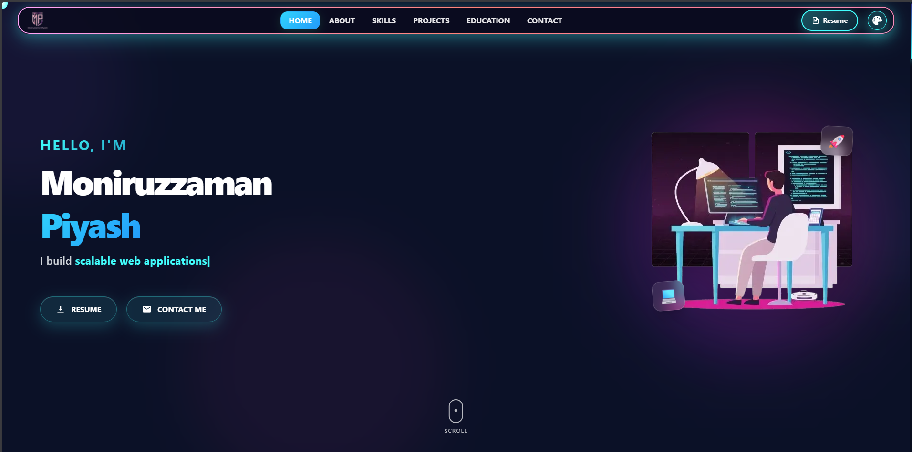

# 🚀 My Portfolio Website

A modern, responsive portfolio built with **Next.js 16**, **React 19**, **Tailwind CSS 4**, and **Framer Motion**.



## ✨ Features

- 🎨 **Dynamic Theme Switching** – Cyberpunk, Ocean, Forest, Sunset themes
- 🌊 **Smooth Animations** – Framer Motion powered transitions
- 📱 **Fully Responsive** – Optimized for mobile, tablet, and desktop
- 🎯 **Interactive Background** – Parallax effects and cursor trails
- 📧 **Contact Form** – EmailJS integration for direct messaging
- 🔄 **3D Project Carousel** – Showcase projects with style

## 🛠️ Tech Stack

| Category   | Technology     |
| ---------- | -------------- |
| Framework  | Next.js 16     |
| UI         | React 19       |
| Styling    | Tailwind CSS 4 |
| Animations | Framer Motion  |
| Email      | EmailJS        |
| TypeScript | Yes            |

## 🚀 Getting Started

```bash
# Clone the repository
git clone https://github.com/Piyash1/My-Portfolio-Website.git

# Install dependencies
npm install

# Run development server
npm run dev
```

Open [http://localhost:3000](http://localhost:3000) to view it in your browser.

## 📦 Build for Production

```bash
npm run build
npm start
```

## 🌐 Deployment

This project is configured for **Netlify** deployment with the included `netlify.toml`.

## 📄 License

This project is licensed under the MIT License - see the [LICENSE](LICENSE) file for details.

## 👤 Author

**Moniruzzaman Piyash**

- LinkedIn: [moniruzzaman-piyash](https://www.linkedin.com/in/moniruzzaman-piyash/)
- GitHub: [@Piyash1](https://github.com/Piyash1)

---

⭐ If you found this project helpful, please give it a star!
